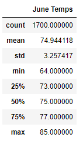
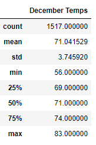

# surfs_up
## Overview
This report takes a look at hawaiian weather data on the island of Oahu to determine if starting a surf and ice cream business is a good idea. Both surfing and the desire to have ice cream are very weather dependent, so performing data analysis on weather in Oahu will help figure out time and location to start a ice cream and surfing business. Using a sqlite database of hawaiian weather values, the report will display statistics of temperature in June and December from 2010 to 2017 and determine the differences in temperature at these months of the year. It will then wrap up by discussing what these temperature values mean and other queries you can run on the sqlite database.

## Resources
Data: [Hawaii SQLite](Resources/hawaii.sqlite)  
Software: Visual Studio Code 1.69.2, Python 3.7.13, Jupyter Notebook 6.4.8, Anaconda 4.13.0  
Python Libraries: pandas, numpy, sqlalchemy  

## Results
Below are the results when querying temperatures on the Hawaiian island of Oahu for June and December from 2010 to 2017. We can see both have a similar mean and median. This means there are no large outliers in our data.

 
> Table 1 and Table 2

Using the above tables we can notice three differences in June and December Temperatures in Oahu:

1. There are more June temperatures recorded. If we look at the count of temperature recordings we see there are nearly 200 more recordings in June than December.
2. June Temperatures are higher across the board. This makes sense from a location in the Northern Hemisphere. June is typically when the sun is closer to the earth and thus the temperature on average is higher. Not only the average temperature, but the min, median, and max values are all higher for June than December. 
3. Lastly, December temperatures have a higher variance in values than June temperatures. December temperatures have a higher standard deviation and thus have values more spread out from the mean. This can be due to the lower number of recordings or a less predictable weather outcome during the month as a whole. 

## Summary
### Summary of June and December Temperatures
So what does the differences in June and December temperatures mean for our surf and ice cream shop? Warmer weather usually indicates a higher desire for a cold ice cream or willingness to be outside surfing. Therefore, a surf and ice cream shop business will see more sales in June as opposed to December. Furthermore, a lower variance in temperatures makes the weather forecast more predictable. It would make sense to start a surf and ice cream shop during June instead of December to get it off the ground.

### Additional Queries
We have only looked at temperatures so far, below are some addtional factors that we can run queries on to obtain a clearer picture of the weather on Oahu:

- We can query based on precipitation to determine if people actually want to be outside and surf. It can be a nice temperature, but if it is raining there will be less business for surfing and ice cream

- We can query temperature based on station. In order to know which part of Oahu to physical set up a shop on we can query weather values based on location (i.e. which station the recordings came from). Maybe there is a difference in temperature or precipitation on the north part of the island as opposed to the south.

With these addtional queries we can develop a better understanding of where and when to start a surf and ice cream business on the hawaiian island of Oahu.